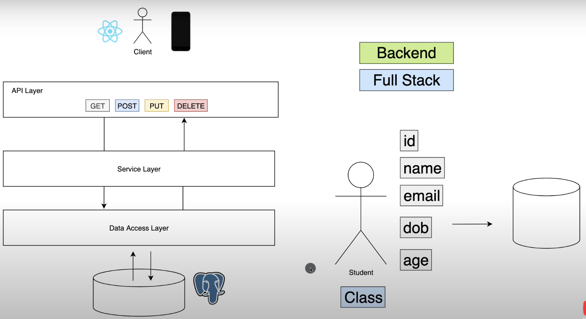

# Practice-SpringBoot Learning Log
## Learning Resources
 - [Spring Boot Tutorial | Full Course] (https://www.youtube.com/watch?v=9SGDpanrc8U)
 - [Amigoscode on PostgresSQL] (https://amigoscode.com/courses/515567/lectures/9454055)

## Structure

## Learning Log
 - Using Postman to test API (GET, PUT(update), POST, DELETE...)
 - Using Postgresql as database and learn SQL command
 - Spring Data JPA
 - Controller(API layer) <-> Service(Service Layer) <-> Repository(Data Access Layer)

## One step further
